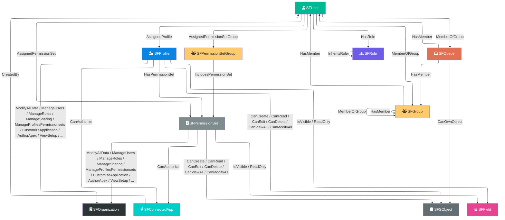

# **SFHound**

> [!TIP]
> Want to read the new documentation? Head over to [sfhound.kaibersec.com](https://sfhound.kaibersec.com/)


## Brief

SalesforceHound collects the data necessary to:

- **Identify, Analyze, and Execute Salesforce Attack Paths**
  Discover attack paths that may degrade the security posture of a Salesforce org.

- **Easily Audit Identity and Access Management**
  Observe both the **configurations** and the **outcomes** created by Salesforce RBAC mechanics — Profiles, Permission Sets, Permission Set Groups, Role Hierarchies, Public Groups, and Queues.

- **Map Field and Object-Level Permissions**
  Surface which users can read, modify, or delete sensitive SObjects and Fields through any combination of permission assignments.

- **Enumerate OAuth and API Attack Surface**
  Trace which identities can authorize Connected Apps and which admins created them.

## Limitations

SalesforceHound has only been tested against Developer Edition and sandbox orgs. It may not scale to large production environments as written.
I would greatly appreciate your feedback on any performance or visibility issues you encounter.

- Individual SharingRule metadata (AccountSharingRule, etc.) requires the Salesforce Metadata API and is not currently extracted. OWD settings are captured per object.
- Queue and group membership in very large orgs (100,000+ GroupMember records) may be slow to extract.
- Field permission extraction may produce a large number of edges; consider scoping to custom fields for initial analysis.

## Collector Setup & Usage

### 1. Install Prerequisites

**System Requirements:**
- Windows, Linux, or macOS (tested on Windows 10/11 and Ubuntu 20.04+)
- Python 3.8 or higher
- pip (Python package manager)
- 2 GB RAM minimum; 4 GB+ recommended for large orgs (10,000+ users)

Clone the repository and install dependencies:

```bash
git clone https://github.com/Khadinxc/SalesforceHound.git
cd SalesforceHound/salesforce-opengraph
pip install -r requirements.txt
```

### 2. Create a Salesforce Connected App

SalesforceHound authenticates via the JWT OAuth flow. You will need to create a Connected App and a certificate.

**Generate a JWT certificate:**

```bash
openssl genrsa -out salesforce_jwt.key 2048
openssl req -new -x509 -key salesforce_jwt.key -out salesforce_jwt.crt -days 365
```

**Create the Connected App:**

1. **Setup → App Manager → New Connected App**
2. Enable OAuth Settings, set Callback URL to `https://login.salesforce.com/services/oauth2/callback`
3. Enable "Use digital signatures" and upload `salesforce_jwt.crt`
4. Add OAuth Scopes: `api`, `refresh_token, offline_access`
5. Save and wait 2–10 minutes for changes to propagate

**Pre-authorize your integration user:**

1. **Setup → Connected Apps → Manage Connected Apps → SalesforceHound → Edit Policies**
2. Set Permitted Users to `Admin approved users are pre-authorized`
3. Add your integration user's Profile or Permission Set under **Manage Profiles** / **Manage Permission Sets**

### 3. Configure Minimum Permissions

#### Privileged User (Recommended — Complete Extraction)

| Permission | Purpose |
|---|---|
| API Enabled | Required for REST/Tooling API access |
| View Setup and Configuration | Query Profiles, PermissionSets, Roles, ConnectedApps, EntityDefinitions, ObjectPermissions |
| View All Data | Query Users, Groups, PermissionSetAssignments, GroupMembers, and all record data |

**Recommended:** System Administrator profile, or a custom profile with the three permissions above.

#### Unprivileged User (Limited Extraction)

| Permission | Purpose |
|---|---|
| API Enabled | Required |
| View Setup and Configuration | Required |
| Read on User, Group, PermissionSetAssignment, GroupMember | Minimum data access |

The collector will extract whatever data is visible to the user. The resulting graph will be incomplete but still useful for analyzing visible attack paths.

**Creating a custom profile:**

1. Setup → Profiles → Clone "Standard User"
2. Enable "API Enabled" and "View Setup and Configuration"
3. Grant Read on: User, Group, PermissionSetAssignment, GroupMember
4. Assign to your integration user

### 4. Configure config.yaml

Copy `config.yaml.example` to `config.yaml` and fill in your values:

```yaml
salesforce:
  client_id: "YOUR_CONNECTED_APP_CONSUMER_KEY"
  username: "your.integration.user@example.com"
  private_key_path: "./salesforce_jwt.key"
  login_url: "https://login.salesforce.com"  # Use https://test.salesforce.com for sandboxes
  api_version: "v56.0"

# Optional: BloodHound CE auto-ingest
# Set auto-ingest: true to always upload after every run, or leave false and use --auto-ingest flag
bloodhound:
  url: "http://127.0.0.1:8080"
  username: "admin"
  password: "YOUR_BLOODHOUND_PASSWORD"
  auto-ingest: false

env:
  output_path: "./opengraph_output"
```

> **Note:** `client_id` is the "Consumer Key" from your Connected App's "Manage Consumer Details" page.

### 5. Run the Collector

```bash
cd salesforce-opengraph
python sfhound.py
```

This produces a BloodHound-compatible JSON file in `./opengraph_output/`.

#### Command-Line Overrides

All `config.yaml` values can be overridden at the command line:

```bash
# View all options
python sfhound.py --help

# Override credentials
python sfhound.py --client-id YOUR_CLIENT_ID --username user@example.com --private-key /path/to/key.pem

# Override output directory
python sfhound.py --output-path /custom/output/directory

# Complete override (no config.yaml needed)
python sfhound.py \
  --client-id YOUR_CLIENT_ID \
  --client-secret YOUR_CLIENT_SECRET \
  --username user@example.com \
  --private-key /path/to/key.pem \
  --login-url https://orgname.my.salesforce.com \
  --api-version v56.0 \
  --output-path ./my_output
```

| Argument | Description | Default |
|---|---|---|
| `--config` | Path to config YAML file | `config.yaml` |
| `--client-id` | Connected App Consumer Key | From config |
| `--client-secret` | Connected App Consumer Secret | From config |
| `--username` | Salesforce username | From config |
| `--private-key` | Path to private key for JWT auth | From config |
| `--login-url` | Salesforce login URL | `https://login.salesforce.com` |
| `--api-version` | Salesforce API version | `v56.0` |
| `--output-path` | Output directory for JSON files | `./opengraph_output` |
| `--auto-ingest` | Upload graph to BloodHound CE after export | Off |
| `--bh-url` | BloodHound CE base URL | `http://127.0.0.1:8080` |
| `--bh-username` | BloodHound CE admin username | From config |
| `--bh-password` | BloodHound CE admin password | From config |

### 6. Register Custom Icons in BloodHound

```python
python examples/post_custom_icons.py
```

### 7. Load Data into BloodHound

#### Option A — Auto-ingest (recommended)

Pass `--auto-ingest` to extract and upload in a single command. BloodHound credentials can come from `config.yaml` or the command line:

```bash
# Credentials in config.yaml
python sfhound.py --auto-ingest

# All credentials on the command line (no bloodhound block needed in config.yaml)
python sfhound.py --auto-ingest \
  --bh-url http://127.0.0.1:8080 \
  --bh-username admin \
  --bh-password YOUR_BLOODHOUND_PASSWORD
```

What auto-ingest does:
1. Validates the exported JSON against the OpenGraph schema
2. Checks for stuck/active jobs in BloodHound and aborts if any exist
3. Creates a BloodHound file-upload job, uploads the graph, and signals ingestion start
4. Polls until ingestion completes, printing status every 15 seconds
5. Prints completed task details including any errors or warnings

> **Note:** Auto-ingest does **not** clear the BloodHound database. If you need a clean slate, clear it manually in the BloodHound UI first.

#### Option B — Manual upload

Drag and drop the output JSON file from `./opengraph_output/` into BloodHound's file upload modal.


### 8. Setup Tier Zero Privilege Zones:

You can define the Tier Zero zone rule in the Bloodhound GUI for System Level permissions capable of compromising a Salesforce Organisation with this Cypher Query:
```
MATCH (u:SFUser)-[:AssignedProfile|AssignedPermissionSet]->(ps)-[:ModifyAllData|ManageUsers|ManageProfilesPermissionsets|AuthorApex|CustomizeApplication|ManageSharing]->(:SFOrganization)
WHERE ps:SFProfile OR ps:SFPermissionSet
RETURN DISTINCT u;
```

You can also define Tier zero users who have access to your highest value objects, just continue to add values to the obj.name IN ["SECRETDATA__C","SENSITIVEDATA__C","HIDDENDATA__C"] and so on, with the following query and set as a cypher rule type:
```
MATCH (u:SFUser)-[:AssignedProfile|AssignedPermissionSet|AssignedPermissionSetGroup|HasPermissionSet|IncludesPermissionSet*1..5]->(ps)-[:CanCreate|CanRead|CanEdit|CanDelete|CanViewAll|CanModifyAll]->(obj:SFSObject)
WHERE obj.name IN ["SECRETDATA__C", "SENSITIVEDATA__C"]
  AND (ps:SFPermissionSet OR ps:SFProfile)
RETURN DISTINCT u;
```

Same with your Tier zero users with access to highest value fields:
```
MATCH (u:SFUser)-[:AssignedProfile|AssignedPermissionSet|AssignedPermissionSetGroup|HasPermissionSet|IncludesPermissionSet|CanCreate|CanRead|CanEdit|CanDelete|CanViewAll|CanModifyAll|IsVisible|ReadOnly|Contains*1..10]->(f:SFField)
WHERE f.name IN ["SECRETDATA__C.HIGHLYSENSITIVEFIELD__C","SECRETDATA__C.OTHERSENSITIVEFIELD__C","SENSITIVEDATA__C.HIGHLYSENSITIVEFIELD__C"]
RETURN DISTINCT u
LIMIT 1000;
```

---

## Schema



### Nodes

| Node Class | Description | Icon | Color |
|---|---|---|---|
| `SFOrganization` | The top-level org container. System permissions are modeled as edges to this node. | building | #2d3436 |
| `SFUser` | A Salesforce user principal | user | #00b894 |
| `SFProfile` | A Profile: the baseline permission assignment for every user. Every user must have exactly one Profile. | user-gear | #0984e3 |
| `SFPermissionSet` | A Permission Set: additive permissions that can be stacked on a user above their Profile | id-badge | #7f8c8d |
| `SFPermissionSetGroup` | A Permission Set Group: a named bundle containing one or more Permission Sets | users | #fdcb6e |
| `SFRole` | A role in the org's role hierarchy. Determines record visibility upward in the hierarchy. | sitemap | #6c5ce7 |
| `SFGroup` | A Public Group: a named collection of users and/or nested groups used in sharing rules | users | #fdcb6e |
| `SFQueue` | A Queue: a group-like object that can own records of configured SObject types | inbox | #e17055 |
| `SFConnectedApp` | A Connected App (OAuth application) registered in the org | plug | #00cec9 |
| `SFSObject` | A Salesforce object (standard or custom) with CRUD and sharing model metadata | database | #636e72 |
| `SFField` | A field on an SObject. Field-Level Security (FLS) edges target these nodes. | list-check | #e84393 |

### Edges

| Edge Type | Source | Target | Description | Traversable |
|---|---|---|---|---|
| `AssignedProfile` | `SFUser` | `SFProfile` | User is assigned to this Profile | Yes |
| `AssignedPermissionSet` | `SFUser` | `SFPermissionSet` | User has been directly assigned this Permission Set | Yes |
| `AssignedPermissionSetGroup` | `SFUser` | `SFPermissionSetGroup` | User has been assigned this Permission Set Group | Yes |
| `HasPermissionSet` | `SFProfile` | `SFPermissionSet` | Profile is backed by its own PermissionSet record (IsOwnedByProfile=true) | Yes |
| `IncludesPermissionSet` | `SFPermissionSetGroup` | `SFPermissionSet` | Permission Set Group includes this Permission Set | Yes |
| `HasRole` | `SFUser` | `SFRole` | User is assigned to this role in the role hierarchy | Yes |
| `InheritsRole` | `SFRole` | `SFRole` | Child role — users in the parent role can see records owned by users in this child role | Yes |
| `MemberOfGroup` | `SFUser` | `SFGroup` | User is a direct member of this Public Group | Yes |
| `MemberOfGroup` | `SFUser` | `SFQueue` | User is a member of this Queue | Yes |
| `MemberOfGroup` | `SFGroup` | `SFGroup` | Nested group membership — this group is a member of another group | Yes |
| `HasMember` | `SFGroup` | `SFUser` | Group contains this user (inverse of MemberOfGroup) | Yes |
| `HasMember` | `SFGroup` | `SFGroup` | Group contains this nested group (inverse of MemberOfGroup) | Yes |
| `HasMember` | `SFQueue` | `SFUser` | Queue contains this user (inverse of MemberOfGroup) | Yes |
| `HasMember` | `SFQueue` | `SFGroup` | Queue contains this group (inverse of MemberOfGroup) | Yes |
| `CanOwnObject` | `SFQueue` | `SFSObject` | Queue is configured to own records of this SObject type | Yes |
| `CanCreate` | `SFProfile` / `SFPermissionSet` | `SFSObject` | Can create new records on this object | Yes |
| `CanRead` | `SFProfile` / `SFPermissionSet` | `SFSObject` | Can read records on this object (subject to sharing) | Yes |
| `CanEdit` | `SFProfile` / `SFPermissionSet` | `SFSObject` | Can edit records on this object (subject to sharing) | Yes |
| `CanDelete` | `SFProfile` / `SFPermissionSet` | `SFSObject` | Can delete records on this object (subject to sharing) | Yes |
| `CanViewAll` | `SFProfile` / `SFPermissionSet` | `SFSObject` | Can view ALL records on this object — bypasses sharing rules | Yes |
| `CanModifyAll` | `SFProfile` / `SFPermissionSet` | `SFSObject` | Can edit/delete ALL records on this object — bypasses sharing rules | Yes |
| `IsVisible` | `SFProfile` / `SFPermissionSet` | `SFField` | Field is readable and editable (PermissionsEdit=true) | Yes |
| `ReadOnly` | `SFProfile` / `SFPermissionSet` | `SFField` | Field is readable but not editable (PermissionsRead=true, PermissionsEdit=false) | Yes |
| `ModifyAllData` | `SFProfile` / `SFPermissionSet` | `SFOrganization` | System permission: modify all records in the org (bypass all sharing) | Yes |
| `ManageUsers` | `SFProfile` / `SFPermissionSet` | `SFOrganization` | System permission: create, edit, activate, and deactivate users | Yes |
| `ManageRoles` | `SFProfile` / `SFPermissionSet` | `SFOrganization` | System permission: create and edit the role hierarchy | Yes |
| `ManageSharing` | `SFProfile` / `SFPermissionSet` | `SFOrganization` | System permission: manage sharing rules and OWD settings | Yes |
| `ManageProfilesPermissionsets` | `SFProfile` / `SFPermissionSet` | `SFOrganization` | System permission: manage profiles and permission sets | Yes |
| `CustomizeApplication` | `SFProfile` / `SFPermissionSet` | `SFOrganization` | System permission: customize Salesforce application metadata | Yes |
| `AuthorApex` | `SFProfile` / `SFPermissionSet` | `SFOrganization` | System permission: create and deploy Apex code | Yes |
| `ViewSetup` | `SFProfile` / `SFPermissionSet` | `SFOrganization` | System permission: view setup and configuration | Yes |
| `ViewAllData` | `SFProfile` / `SFPermissionSet` | `SFOrganization` | System permission: read every record in the org regardless of sharing or OWD — exfiltration risk | Yes |
| `ApiEnabled` | `SFProfile` / `SFPermissionSet` | `SFOrganization` | System permission: allows all programmatic API access (REST, SOAP, Bulk, Metadata, Tooling) | Yes |
| `ManageTranslation` | `SFProfile` / `SFPermissionSet` | `SFOrganization` | System permission: manage the Translation Workbench — can rename fields and labels org-wide | Yes |
| `EditTask` | `SFProfile` / `SFPermissionSet` | `SFOrganization` | System permission: edit Task records owned by other users — **sharing-gated**: only tasks already visible via OWD/role hierarchy. Blast radius expands to all tasks when combined with `ViewAllData` | Yes |
| `EditEvent` | `SFProfile` / `SFPermissionSet` | `SFOrganization` | System permission: edit Event (calendar) records owned by other users — **sharing-gated** via ControlledByParent OWD. Blast radius expands to all events when combined with `ViewAllData` | Yes |
| *(other system permissions)* | `SFProfile` / `SFPermissionSet` | `SFOrganization` | Additional Permissions* flags captured as edge types when true | Yes |
| `CanAuthorize` | `SFProfile` / `SFPermissionSet` | `SFConnectedApp` | Profile or Permission Set grants users the right to OAuth-authorize this Connected App | Yes |
| `CreatedBy` | `SFConnectedApp` | `SFUser` | Records the admin who created this Connected App — audit/provenance edge | No |

### Edge Context Properties

All named edges in the table above carry the following contextual properties, visible in the BloodHound edge panel:

| Property | Description |
|---|---|
| `General` | What the edge represents and how the permission or relationship works |
| `AbuseInfo` | How an attacker can exploit this edge — escalation paths, blast radius, and prerequisites |
| `RemediationInfo` | Actionable steps to restrict or remediate this access, including specific SOQL audit queries where applicable |
| `OPSEC` | What is and is not logged when this edge is exercised — gaps in standard audit visibility an attacker could exploit |
| `References` | MITRE ATT&CK technique mapping and Salesforce documentation URLs for the underlying permission or relationship |

> Properties are populated for all edges that have a named entry in `edges.py` (system permissions, object CRUD, assignment, group/access edges). Structural edges emitted dynamically for every `Permissions*` flag not in the named context dictionary carry only the `SystemPermission` property.

---

## Design Decisions

This section documents intentional architectural choices in the graph model, including the tradeoffs involved and why alternatives were rejected.

### System Permissions as Edges, Not Nodes

Salesforce exposes hundreds of `Permissions*` boolean fields on `Profile` and `PermissionSet` records (e.g., `PermissionsModifyAllData`, `PermissionsAuthorApex`). Rather than creating a separate node for each system permission, SalesforceHound models each enabled permission as a **typed edge** from the granting `SFProfile`/`SFPermissionSet` to the central `SFOrganization` node.

**Why:** BloodHound path traversal queries work best when privilege escalation is represented as edge relationships rather than node properties. Modeling system permissions as edges means standard shortest-path queries (`-[:ModifyAllData]->`) immediately surface every user who holds that permission through any assignment chain — no additional filtering on properties is required post-traversal.

**Tradeoff:** Queries that ask "list all permissions on a PermissionSet" require reading outgoing edge types to `SFOrganization` rather than reading a single node's property bag. This is natural in Cypher (`MATCH (ps)-[r]->(org:SFOrganization) RETURN type(r)`) and does not impose meaningful overhead.

### CanOwnObject Targets Resolved via SObject Lookup

Salesforce `QueueSobject` records contain only the API name of the object type a Queue can own (e.g., `Case`, `Incident`), not a Salesforce record ID. An early implementation created virtual destination nodes with a synthetic `SOBJECT::{TYPE}` identifier, which resulted in dangling edges because those virtual IDs had no matching `SFSObject` node in the graph.

**Current approach:** `build_queue_object_access` receives the same `sobject_lookup` dictionary used by CRUD permission edges (maps `QualifiedApiName` → `DurableId`). `CanOwnObject` edges are only emitted when the SObject type is present in that lookup — i.e., it exists in the org's `EntityDefinition` and was extracted. Queue-to-SObject relationships are therefore consistent with the rest of the object permission graph, and no virtual nodes are needed.

**Tradeoff:** Queues that own SObject types absent from `EntityDefinition` (e.g., deprecated or inaccessible objects) will not have `CanOwnObject` edges in the graph. This is intentional — edges to non-existent nodes provide no traversal value and inflate the dangling edge warning count.

### Aggregate PermissionSet Nodes Hydrated as Placeholders

Salesforce internally generates a hidden `PermissionSet` record for every `PermissionSetGroup` (identifiable by the `0PSG...` ID prefix). These aggregate records accumulate the union of all constituent PermissionSet permissions and appear as `ParentId` values in `ObjectPermissions` and `FieldPermissions`, but they are **not returned** by a standard `SELECT ... FROM PermissionSet` query.

Without handling this, every CRUD and FLS edge sourced from an aggregate PermSet would dangle (source node missing).

**Current approach:** After the main node-building phase, `sfhound.py` scans all `ObjectPermissions` and `FieldPermissions` source IDs against the set of already-built nodes. Any `0PSG...` ID (or any other ParentId) not yet present is materialized as a minimal placeholder `SFPermissionSet` node labelled `[AggregatePermSet] <ID>`. This keeps all edges fully anchored.

**Tradeoff:** Placeholder nodes carry only an ID and a synthetic name — they have none of the rich metadata a normally-queried PermissionSet would have. If a future version can extract aggregate PermSet metadata directly, the placeholder hydration step can be removed or merged with the normal extraction path.

### CanOwnObject and CRUD Edges Share the Same sobject_lookup

Both `build_queue_object_access` and `build_object_permissions` need to map an SObject API name to a graph node ID. The `sobject_lookup` dictionary (`QualifiedApiName` → `DurableId`) is constructed once in `sfhound.py` and passed to both builders. This ensures:
- No duplication of the lookup construction logic
- Both edge types point to the exact same `SFSObject` node IDs
- Filtering of unresolvable SObject types is consistent across both builders

---

## Custom Cypher Queries

### User Hunting

Relationships to the 6th degree for a specific user:
```cypher
MATCH (u:SFUser)
WHERE u.name = "PETER WIENER"
MATCH p = (u)-[*1..6]->(n)
RETURN DISTINCT p
```

### Object Permission Hunting

Users with access to crown jewels:
```cypher
MATCH path = (u:SFUser)-[:AssignedProfile|AssignedPermissionSet|AssignedPermissionSetGroup|HasPermissionSet|IncludesPermissionSet*1..5]->(ps)-[r:CanCreate|CanRead|CanEdit|CanDelete|CanViewAll|CanModifyAll]->(obj:SFSObject)
WHERE u.name = "PETER WIENER" AND obj.name = "SECRETDATA__C"
AND (ps:SFPermissionSet OR ps:SFProfile)
RETURN path
```

Shortest path to any custom Salesforce objects:
```cypher
MATCH p=(u:SFUser)-[:AssignedProfile|AssignedPermissionSet|AssignedPermissionSetGroup|HasPermissionSet|IncludesPermissionSet|CanCreate|CanRead|CanEdit|CanDelete|CanViewAll|CanModifyAll|IsVisible|ReadOnly|Contains*1..10]->(f:SFSObject)
WHERE f.name ENDS WITH '__C'
  AND u <> f
RETURN p
LIMIT 1000
```

```cypher
MATCH p=allShortestPaths((u:SFUser)-[:AssignedProfile|AssignedPermissionSet|AssignedPermissionSetGroup|HasPermissionSet|IncludesPermissionSet|CanCreate|CanRead|CanEdit|CanDelete|CanViewAll|CanModifyAll|IsVisible|ReadOnly|Contains*1..10]->(f:SFSObject))
WHERE f.name ENDS WITH '__C'
  AND u <> f
RETURN p
LIMIT 1000
```

### Field Permission Hunting

Shortest path from a user to a specific field:
```cypher
MATCH p=shortestPath((u:SFUser)-[:AssignedProfile|AssignedPermissionSet|AssignedPermissionSetGroup|HasPermissionSet|IncludesPermissionSet|CanCreate|CanRead|CanEdit|CanDelete|CanViewAll|CanModifyAll|IsVisible|ReadOnly|Contains*1..10]->(f:SFField))
WHERE u.name = "PETER WIENER" 
  AND f.name = "SECRETDATA__C.HIGHLYSENSITIVEFIELD__C"
  AND u <> f
RETURN p
LIMIT 1000
```

Shortest path to crown jewel fields:
```cypher
MATCH p=shortestPath((u:SFUser)-[:AssignedProfile|AssignedPermissionSet|AssignedPermissionSetGroup|HasPermissionSet|IncludesPermissionSet|CanCreate|CanRead|CanEdit|CanDelete|CanViewAll|CanModifyAll|IsVisible|ReadOnly|Contains*1..10]->(f:SFField))
WHERE f.name = "SECRETDATA__C.HIGHLYSENSITIVEFIELD__C"
  AND u <> f
RETURN p
LIMIT 1000
```

All users with access to any custom fields:
```cypher
MATCH p=(u:SFUser)-[:AssignedProfile|AssignedPermissionSet|AssignedPermissionSetGroup|HasPermissionSet|IncludesPermissionSet|CanCreate|CanRead|CanEdit|CanDelete|CanViewAll|CanModifyAll|IsVisible|ReadOnly|Contains*1..10]->(f:SFField)
WHERE f.name ENDS WITH '__C'
  AND u <> f
RETURN p
LIMIT 1000
```

### Generic Counts

All Users:
```cypher
MATCH (m:SFUser) RETURN m
```

All Permission Sets:
```cypher
MATCH (m:SFPermissionSet) RETURN m
```

All Nodes and Relationships (expensive):
```cypher
MATCH (n)
OPTIONAL MATCH (n)-[r]->(m)
RETURN n, r, m
LIMIT 500
```

### System Permission Queries

> **Note:** System permissions (e.g., `ModifyAllData`, `ViewSetup`) are modeled as edges to the `SFOrganization` node rather than as separate permission nodes. Each system permission is an edge type from `SFProfile`/`SFPermissionSet` to `SFOrganization`.

**Available system permissions in graph:**
`ModifyAllData`, `ViewAllData`, `ViewSetup`, `ManageUsers`, `ManageRoles`, `ManageSharing`, `ManageProfilesPermissionsets`, `ManageTranslation`, `CustomizeApplication`, `AuthorApex`, `ApiEnabled`, `EditTask`, `EditEvent`

**High-Risk Permissions (Tier 0):**

Shortest path to org compromise:
```cypher
MATCH p=(u:SFUser)-[:AssignedProfile|AssignedPermissionSet|AssignedPermissionSetGroup|HasPermissionSet|IncludesPermissionSet*1..5]->(ps)-[r:ModifyAllData|ManageSharing|ManageProfilesPermissionsets|CustomizeApplication|AuthorApex|ManageUsers|ManageRoles]->(org:SFOrganization)
WHERE (ps:SFProfile OR ps:SFPermissionSet)
  AND u <> org
RETURN p
LIMIT 1000
```

All users with a specific high-risk permission (replace `ModifyAllData` as needed):
```cypher
MATCH path = (u:SFUser)-[:AssignedProfile|AssignedPermissionSet]->(ps)-[:ModifyAllData]->(org:SFOrganization)
WHERE ps:SFProfile OR ps:SFPermissionSet
RETURN path
```

All system permissions held by a specific user:
```cypher
MATCH (u:SFUser {Username: "username@example.com"})-[:AssignedProfile|AssignedPermissionSet]->(ps)-[perm]->(org:SFOrganization)
WHERE ps:SFProfile OR ps:SFPermissionSet
RETURN u.name AS UserName, 
       ps.name AS PermissionSetOrProfile,
       type(perm) AS SystemPermission
```

Count how many users have each system permission:
```cypher
MATCH (u:SFUser)-[:AssignedProfile|AssignedPermissionSet]->(ps)-[perm]->(org:SFOrganization)
WHERE ps:SFProfile OR ps:SFPermissionSet
RETURN type(perm) AS Permission, COUNT(DISTINCT u) AS UserCount
ORDER BY UserCount DESC
```

### Role Hierarchy Queries

All users and their role assignments:
```cypher
MATCH (u:SFUser)-[h:HasRole]->(r:SFRole)
RETURN u, h, r
```

Role hierarchy tree (up to 5 levels):
```cypher
MATCH path = (child:SFRole)-[:InheritsRole*1..5]->(ancestor:SFRole)
WHERE NOT (ancestor)-[:InheritsRole]->()
RETURN path
```

Portal role users:
```cypher
MATCH (u:SFUser)-[:HasRole]->(r:SFRole)
WHERE r.IsPortalRole = True
RETURN u, r
```

### Group & Queue Queries

All Public Groups:
```cypher
MATCH (g:SFGroup)
RETURN g
```

Public Group membership (including nested groups):
```cypher
MATCH (g:SFGroup)-[h:HasMember]->(m)
RETURN g, h, m
```

Users in a specific Public Group (direct and via nested groups):
```cypher
MATCH path = (g:SFGroup {name: 'KaiberSecInternalUsers'})-[:HasMember*1..3]->(u:SFUser)
RETURN path
```

All Queues:
```cypher
MATCH (q:SFQueue)
RETURN q
```

Queue members:
```cypher
MATCH (q:SFQueue)-[h:HasMember]->(m)
RETURN q, h, m
```

### Connected App Queries

All ConnectedApps:
```cypher
MATCH (app:SFConnectedApp)
RETURN app
```

ConnectedApps and their creators:
```cypher
MATCH p = (app:SFConnectedApp)-[:CreatedBy]->(u:SFUser)
RETURN p
```

Which admin created the most apps:
```cypher
MATCH (app:SFConnectedApp)-[:CreatedBy]->(u:SFUser)
RETURN u.name AS Admin, count(app) AS AppCount
ORDER BY AppCount DESC
```

Which Profiles/PermissionSets can authorize which ConnectedApps:
```cypher
MATCH p = (ps)-[:CanAuthorize]->(app:SFConnectedApp)
RETURN p
```

Complete attack path: user to ConnectedApp authorization:
```cypher
MATCH path = (u:SFUser)-[:AssignedProfile|AssignedPermissionSet*1..2]->(ps)-[:CanAuthorize]->(app:SFConnectedApp)
RETURN path
```

ConnectedApps that allow self-authorization (security risk):
```cypher
MATCH (app:SFConnectedApp)
WHERE app.AdminApprovedUsersOnly = False
RETURN app.name, app.AdminApprovedUsersOnly, app.CreatedDate
```

### SObject & CRUD Permission Queries

All custom objects (potential sensitive data):
```cypher
MATCH (obj:SFSObject)
WHERE obj.IsCustom = True
RETURN obj.name, obj.Label, obj.InternalSharingModel
```

All users who can delete a specific object:
```cypher
MATCH (u:SFUser)-[:AssignedProfile|AssignedPermissionSet|AssignedPermissionSetGroup|HasPermissionSet|IncludesPermissionSet*1..5]->(p)-[:CanDelete]->(obj:SFSObject {name: "SECRETDATA__C"})
WHERE (p:SFPermissionSet OR p:SFProfile)
RETURN DISTINCT u.name as User, p.name as GrantedBy, obj.Label as Object
```

Find users with ModifyAll (bypass sharing rules):
```cypher
MATCH (u:SFUser)-[:AssignedProfile|AssignedPermissionSet|AssignedPermissionSetGroup|HasPermissionSet|IncludesPermissionSet*1..5]->(p)-[:CanModifyAll]->(obj:SFSObject)
WHERE obj.IsCustom = True
AND (p:SFPermissionSet OR p:SFProfile)
RETURN DISTINCT u.name as User, obj.name as CustomObject, obj.Label
ORDER BY u.name, obj.name
```

Users with suspicious permissions (Create + Delete + ModifyAll on same object):
```cypher
MATCH (u:SFUser)-[:AssignedProfile|AssignedPermissionSet|AssignedPermissionSetGroup|HasPermissionSet|IncludesPermissionSet*1..5]->(p1)-[:CanCreate]->(obj:SFSObject),
      (u)-[:AssignedProfile|AssignedPermissionSet|AssignedPermissionSetGroup|HasPermissionSet|IncludesPermissionSet*1..5]->(p2)-[:CanDelete]->(obj),
      (u)-[:AssignedProfile|AssignedPermissionSet|AssignedPermissionSetGroup|HasPermissionSet|IncludesPermissionSet*1..5]->(p3)-[:CanModifyAll]->(obj)
WHERE (p1:SFPermissionSet OR p1:SFProfile)
AND (p2:SFPermissionSet OR p2:SFProfile)
AND (p3:SFPermissionSet OR p3:SFProfile)
RETURN DISTINCT u.name, obj.name, obj.Label
```

### Sharing Model Analysis

> **Note:** OWD sharing models are captured in `InternalSharingModel` and `ExternalSharingModel` on `SFSObject` nodes. Individual SharingRule records require the Metadata API and are not currently extracted.

Objects with most restrictive sharing (Private):
```cypher
MATCH (obj:SFSObject)
WHERE obj.InternalSharingModel = "Private"
RETURN obj
ORDER BY obj.name
LIMIT 50
```

Custom objects with public access (potential data leak):
```cypher
MATCH (obj:SFSObject)
WHERE obj.IsCustom = True
  AND obj.InternalSharingModel IN ["Public Read/Write", "ReadWrite", "Public Read Only", "Read"]
RETURN obj
```

Sharing model mismatch (internal vs external):
```cypher
MATCH (obj:SFSObject)
WHERE obj.InternalSharingModel <> obj.ExternalSharingModel
RETURN obj
LIMIT 50
```

## Extending the Graph

Adding new node and edge types is now a three-step process thanks to [bhopengraph](https://github.com/p0dalirius/bhopengraph) native classes. 

### Adding a new Node type

**1. Add a builder method in [`graph/nodes.py`](sf-opengraph/graph/nodes.py):**

```python
def build_my_thing(self, records: list) -> list:
    nodes = []
    for r in records:
        props = {"name": r.get("Name"), "someField": r.get("SomeField__c")}
        nodes.append(make_node(r["Id"], "SFMyThing", props))
    return nodes
```

`make_node()` automatically normalises the ID (strip + uppercase), drops `None` and non-primitive values, and sets `objectid`.

**2. Call it in the main pipeline in [`sfhound.py`](sf-opengraph/sfhound.py):**

```python
for node in node_builder.build_my_thing(my_thing_data):
    graph.add_or_merge_node(node)
```

`add_or_merge_node()` handles deduplication automatically — if the same ID is emitted by multiple builders the kinds are unioned and properties are merged (last-write wins).

**3. Optionally register the kind label for summary output in [`graph/sfgraph.py`](sf-opengraph/graph/sfgraph.py):**

```python
"SFMyThing": "my things",
```

---

### Adding a new Edge type

**1. Register the edge kind string in [`graph/edges.py`](sf-opengraph/graph/edges.py) under `EdgeKinds`:**

```python
MY_THING_RELATION = "SFMyThingRelation"
```

**2. Add a builder method in the same file:**

```python
def build_my_thing_edges(self, records: list) -> list:
    edges = []
    for r in records:
        edges.append(_make_edge(r["Id"], r["RelatedId"], EdgeKinds.MY_THING_RELATION))
    return edges
```

`_make_edge()` normalises start/end IDs and filters non-primitive properties. Pass an optional `properties` dict as the fourth argument for context that should appear in the BloodHound edge panel.

**3. Call it in the main pipeline in [`sfhound.py`](sf-opengraph/sfhound.py):**

```python
for edge in edge_builder.build_my_thing_edges(my_thing_data):
    graph.add_edge_without_validation(edge)
```

`check_dangling()` runs automatically at export time and will flag any edges whose endpoint nodes are missing from the graph, so wiring mistakes are caught immediately.

---

## Contributing

We welcome and appreciate contributions! To make the process smooth and efficient, please follow these steps:

1. **Discuss Your Idea**
   - If you've found a bug or want to propose a new feature, open an issue in this repo. Describe the problem or enhancement clearly so we can discuss the best approach before work begins.

2. **Fork & Create a Branch**
   - Fork this repository to your own account.
   - Create a topic branch for your work:
     ```bash
     git checkout -b feat/my-new-feature
     ```

3. **Implement & Test**
   - Follow the existing style and patterns in the codebase.
   - Add or update examples to cover your changes.
   - Verify your code runs successfully:
     ```bash
     cd salesforce-opengraph
     python sfhound.py
     ```
   - Confirm the output JSON is valid and loads into BloodHound.

4. **Submit a Pull Request**
   - Push your branch to your fork:
     ```bash
     git push origin feat/my-new-feature
     ```
   - Open a Pull Request against the `main` branch.
   - In the PR description include:
     - **What** you've changed and **why**
     - **How** to reproduce/test your changes
     - A sample of the output JSON for any new node or edge types

5. **Review & Merge**
   - Your PR will be reviewed, feedback given if needed, and merged once everything checks out.
   - Larger or more complex changes may take longer to review — thank you in advance for your patience!

---

## Licensing

```
Copyright 2025 Khadinxc

This program is free software: you can redistribute it and/or modify it under
the terms of the GNU General Public License as published by the Free Software
Foundation, either version 3 of the License, or (at your option) any later version.

This program is distributed in the hope that it will be useful, but WITHOUT ANY
WARRANTY; without even the implied warranty of MERCHANTABILITY or FITNESS FOR A
PARTICULAR PURPOSE. See the GNU General Public License for more details.

You should have received a copy of the GNU General Public License along with
this program. If not, see https://www.gnu.org/licenses/.
```
